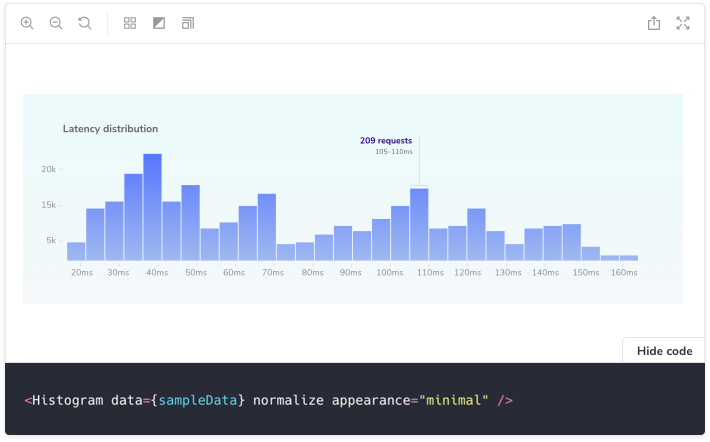

The `Canvas` block is a wrapper around a [`Story`](./doc-block-story.md), featuring a toolbar that allows you to interact with its content while automatically providing the required [`Source`](./doc-block-source.md) snippets.



When using the Canvas block in MDX, it references a story with the `of` prop:

<!-- prettier-ignore-start -->
```md
{/* ButtonDocs.mdx */}
import { Meta, Story, Canvas } from '@storybook/blocks';
import * as ButtonStories from './Button.stories';

<Meta of={ButtonStories} />

<Canvas of={ButtonStories.Primary} />
```
<!-- prettier-ignore-end -->

<div class="aside">

💡 In previous versions of Storybook it was possible to pass in arbitrary components as children to `Canvas`. That is deprecated and the `Canvas` block now only supports a single story.

</div>

## API

### Canvas

```js
import { Canvas } from '@storybook/blocks';
```

`Canvas` is a React component which accepts props of type `CanvasProps`.

<div class="aside">

ℹ️ Like most blocks, the `Canvas` block can both be configured via props when using it directly in MDX, or with properties in `parameters.docs.canvas`.

</div>

#### `CanvasProps`

##### `additionalActions`

Type:

```ts
Array<{
  title: string | JSX.Element;
  className?: string;
  onClick: () => void;
  disabled?: boolean;
}>
```

Provides any additional custom actions to show in the bottom right corner. These are simple buttons that do anything you specify in the `onClick` function.

<!-- prettier-ignore-start -->
```md
{/* ButtonDocs.mdx */}
import { Meta, Story, Canvas, SourceState } from '@storybook/blocks';
import * as ButtonStories from './Button.stories';

<Meta of={ButtonStories} />

{/* with an additional action */}
<Canvas
  additionalActions={[
    {
      title: 'Open in GitHub',
      onClick: () => {
        window.open(
          'https://github.com/storybookjs/storybook/blob/next/code/ui/blocks/src/examples/Button.stories.tsx',
          '_blank'
        );
      },
    }
  ]}
  of={ButtonStories.Primary}
/>
```
<!-- prettier-ignore-end -->

##### `className`

Type: `string`

Provides HTML class(es) to the preview element, for custom styling.

##### `layout`

Type: `'padded' | 'centered' | 'fullscreen'`

Default: `'padded'`

Specifies how the canvas should layout the story.

- **padded**: Add padding to the story
- **centered**: Center the story within the canvas
- **fullscreen**: Show the story as-is, without padding

The canvas in docs will respect the `parameters.layout` value that defines how a story is laid out in the regular story view, but that can also be overridden with this prop.

##### `meta`

Type: CSF file exports

Specifies the CSF file to which the story is associated.

You can render a story from a CSF file that you haven’t attached to the MDX file (via `Meta`) by using the `meta` prop. Pass the **full set of exports** from the CSF file (not the default export!).

<!-- prettier-ignore-start -->
```md
{/* ButtonDocs.mdx */}
import { Meta, Canvas } from '@storybook/blocks';
import * as ButtonStories from './Button.stories';
import * as HeaderStories from './Header.stories';

<Meta of={ButtonStories} />

{/* Although this MDX file is largely concerned with Button,
    it can render Header stories too */}
<Canvas of={HeaderStories.LoggedIn} meta={HeaderStories} />
```
<!-- prettier-ignore-end -->

##### `of`

Type: Story export

Specifies which story's source is displayed.

##### `source`

Type: `Omit<SourceProps, 'dark'>`

See [SourceProps](./doc-block-source.md#sourceprops).

<div class="aside">

💡 The dark prop is ignored, as the `Source` block is always rendered in dark mode when shown as part of a `Canvas` block.

</div>

##### `sourceState`

Type: `'hidden' | 'shown' | 'none'`

Default: `'hidden'`

Specifies the initial state of the source panel.

- **hidden**: the source panel is hidden by default
- **shown**: the source panel is shown by default
- **none**: the source panel is not available and the button to show it is not rendered

##### `story`

Type: `Pick<StoryProps, 'inline' | 'height' | 'autoplay'>`

Specifies props to pass to the inner `Story` block. See [StoryProps](./doc-block-story.md#storyprops).

##### `withToolbar`

Type: `boolean`

Determines whether to render a toolbar containing tools to interact with the story.

##### `children` (deprecated)

Type: `ReactNode`

Expects only [Story](./doc-block-story.md) children. Reference the story with the `of` prop instead.

##### `columns` (deprecated)

Type: `number`

Splits the stories based on the number of defined columns. Multiple stories are not supported.

##### `isColumn` (deprecated)

Type: `boolean`

Displays the stories one above the other. Multiple stories are not supported.

##### `mdxSource` (deprecated)

Type: `string`

Provides source to display. Use [`source.code`](#source) instead.

##### `withSource` (deprecated)

Type: `DeprecatedSourceState`

Controls the source code block visibility. Use [`sourceState`](#sourcestate) instead.

##### `withToolbar` (deprecated)

Type: `boolean`

Sets the Canvas toolbar visibility. Use [`story.withToolbar`](#story) instead.
